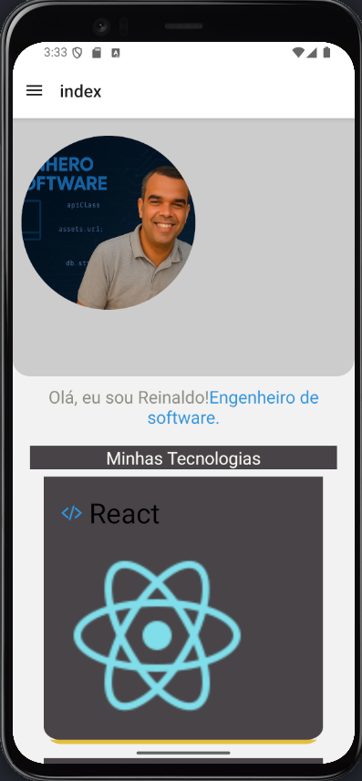
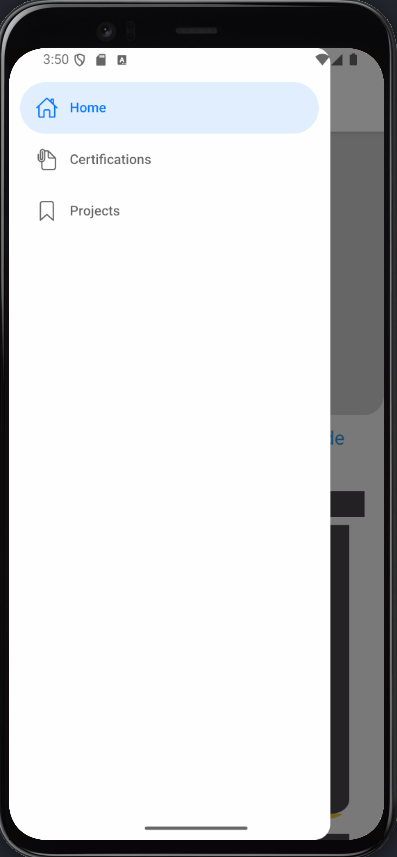
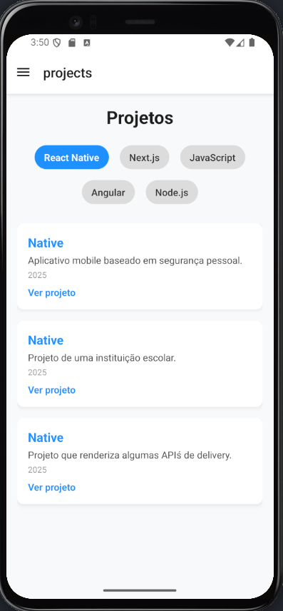

# 👨‍💻 Portfólio Mobile - Reinaldo Pereira

Aplicativo desenvolvido em **React Native** com o objetivo de apresentar meu portfólio de forma moderna, elegante e funcional.

O app exibe minhas **tecnologias dominadas**, **certificados conquistados** e **projetos desenvolvidos**, organizados por categorias e com navegação amigável.

---

## 🧭 Navegação do App






### 🏠 Home

> Página inicial com uma breve apresentação e visualização das tecnologias que domino.

- Foto pessoal em destaque
- Lista de tecnologias (React, Node.js, Next.js, etc.)
- Ícones personalizados com `Ionicons`
- Layout responsivo e visual limpo

---

### 🎓 Certificados

> Visualização organizada dos certificados obtidos em diferentes plataformas de ensino.

- Categorias: `DIO - Java`, `Python`, `Google`, `Zylyty`, etc.
- Clique no botão para alternar entre categorias
- Cada certificado apresenta:
  - Título
  - Instituição
  - Ano
  - Link direto para visualização externa (abre no navegador)

---

### 🚀 Projetos

> Página com uma galeria de projetos pessoais e acadêmicos organizados por tecnologia.

- Categorias:
  - React Native
  - Next.js
  - JavaScript (Vanilla)
  - Angular
  - Node.js
- Cada projeto apresenta:
  - Nome do projeto
  - Descrição
  - Data
  - Link para repositório ou deploy publicado
- Estilização diferenciada com paleta de cores moderna

---

## 📁 Estrutura de Pastas

```bash
├── assets/
│ └── images/
├── components/
├── constants/
│ ├── certifications.ts
│ ├── projetos.ts
│ └── Tecnology.ts
├── app/
│ ├── HomeScreen.tsx
│ ├── CertificationsScreen.tsx
│ └── ProjectsScreen.tsx
├── package.json
├── package-lock.json
├── README.md
├── styles
│   ├── CertificateStyle.tsx
│   ├── HomeStyle.tsx
│   └── ProjectStyle.tsx
├── tsconfig.json
└── types
    ├── typeCertificate.ts
    ├── typeHome.ts
    └── typeProjects.ts         

```


---

## 🛠️ Tecnologias Utilizadas

- [React Native](https://reactnative.dev/)
- [Expo](https://expo.dev/)
- [TypeScript](https://www.typescriptlang.org/)
- [Ionicons](https://icons.expo.fyi/)
- [FlatList](https://reactnative.dev/docs/flatlist)
- Estilos organizados por `StyleSheet`
- Modularização por `types`, `constants`, `styles`

---

## 📷 Preview do App

Em construção... *(adicione prints do app rodando no simulador ou em um dispositivo físico)*

---

## 🚀 Como Rodar o Projeto

```bash
# Clone o repositório
git clone https://github.com/reinaldoper/about-mobile.git

cd about-mobile

# Instale as dependências
npm install

# Rode o projeto
npx expo start
```

✍️ Autor
Reinaldo Pereira dos Santos
📍 Dourados, MS
📫 reinaldoper83@gmail.com
🚀 Engenheiro de Software | Fullstack Developer
